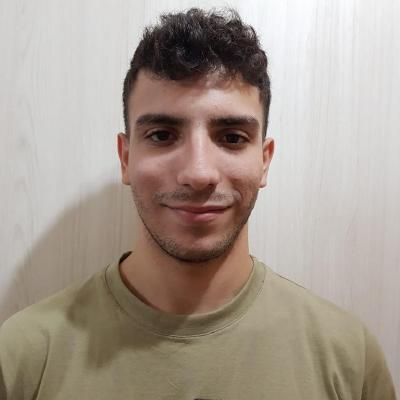

# Los Alomantes
## Presentaciones

---

### Santiago Diego Otta Mendez

**Sobre mi**

Soy estudiante de la Tecnicatura en Desarrollo de Software en la Universidad Argentina de la Empresa (UADE). Actualmente trabajo en la Universidad de Buenos Aires (UBA), donde automatizo flujos de datos, creo, administro y mantengo programas para los distintos departamentos del Rectorado y colaboro con el programa de modernización institucional.

**🎯 Objetivos**
- Finalizar la Tecnicatura en Desarrollo de Software y seguir mi formacion universitaria.
- Profundizar y expandir mis conocimientos técnicos en las áreas que ya domino.
- Mejorar mi comunicacion y forma de expresarme.

**🏆 Logros**
- Trabajo en la UBA automatizando procesos y generando soluciones reales para el Rectorado
- Retomé mis estudios con determinación tras un período de pausa, sin perder el ritmo
- Desarrollo y mantengo programas en producción utilizados por distintas áreas institucionales

**❤️ Gustos**
- Automatización de procesos
- Desarrollo web 
- Leer (mucho)
- Fútbol

**💻 Conocimientos**

- Lenguajes: Python (Avanzado), Java 21, JavaScript.
- Bases de Datos: SQL (Relacionales), PostgreSQL.
- Web & Frontend: React, HTML5, CSS3.
- Herramientas & DevOps: Git, GitHub.
- Idiomas: Español (Nativo), Inglés B2.  

---

### Matias Ezequiel Saafigueroa Dobarro

**Sobre mi**

Estudiante de Técnico Universitario en Desarrollo de Software en la UADE (3er año en curso) y desarrollador con enfoque en Python.
Apasionado por el desarrollo de software, la arquitectura de bases de datos (SQL y NoSQL), la virtualización/despliegue con Docker y el comercio de tecnología.

**🎯 Objetivos**

- Consolidar mi formación en Ingeniería de Software y arquitectura de datos distribuidos. 
- Aplicar y profundizar conocimientos en el desarrollo Backend con Python y Java. 
- Diseñar e implementar soluciones tecnológicas automatizadas para optimizar la gestión comercial y operacional.  

**🏆 Logros**

- Sistema de Gestión Deportiva: Diseño e implementación de un sistema en Java para reserva de canchas y procesamiento de pagos.
- Automatización de Consultorio: Desarrollo de una herramienta de escritorio con Python y Tkinter para la gestión de turnos y fichas odontológicas.
- Diseño y Arquitectura de Datos: Implementación de modelos relacionales (SQL) y bases NoSQL (Redis, MongoDB, Grafos) para diversos entornos del ámbito académico y comercial. 
- Emprendimiento e Infraestructura: Gestión de servicios de armado/customización de hardware de alto rendimiento e integración de canales digitales de venta.

**❤️ Gustos**

- Desarrollo de software y programación en Python.
- Hardware, customización y armado de PCs de alto rendimiento.
- Comercio e innovación en productos tecnológicos y dispositivos electrónicos.
- Jugar Handball

**💻 Conocimientos**

- Lenguajes: Python (Avanzado), Java 21, JavaScript.
- Bases de Datos: SQL (Relacionales), NoSQL (MongoDB, Cassandra, Redis, Grafos / Orientadas a Documentos).
- Web & Frontend: React, HTML5, CSS3.
- Herramientas & DevOps: Docker, Git, GitHub, Vercel, Manual QA.
- Idiomas: Español (Nativo), Inglés Técnico.  

---

### Santiago Agustin Elcano

**Sobre mi**

- Soy estudiante de la tecnicatura en desarrollo software en la universidad Argentina de la empresa (UADE). Actualmente no estoy trabajando, poseo conocimientos en ciencias sociales y historia además de los conocimientos que estoy adquiriendo en la carrera.

**🎯 Objetivos**

- Recibirme  
- Trabajar de lo que estoy estudiando
- Reforzar mis conocimientos 
- Mejorar mi liderazgo y administración 

**🏆 Logros**

- CCNA 1 (Introduccion al networking)

**❤️ Gustos**

- Independiente de avellaneda  
- Futbol
- Leer 
- Videojuegos

**💻 Conocimientos**

- Lo basico de java
- Python
- HTML/CSS
- SQL

---

### Giuliana Cataldi

**Sobre mi**

Mi nombre es Giuliana Cataldi, tengo 22 años y soy estudiante en la Licenciatura de Tecnología de la Información en UADE. Actualmente soy desarrolladora fullstack para un negocio pero me quiero desarrollar profesionalmente en el área de seguridad informática.

**🎯 Objetivos**

- Recibirme.
- Trabajar de lo que me gusta.
- Poder ser independiente. 

**🏆 Logros**

- Poder animarme a especializarme en el area que me gusta.
- Haber avanzado en la carrera.

**❤️ Gustos**

- La lectura
- Programar
- Jugar videojuegos

**💻 Conocimientos**

- Java - Python - Kali Linux - SQL - React - Javascript

---

### Thiago Luciano Arce

**Sobre mí**

Tengo 22 años y estudio la carrera de ingenieria informatica en la facultad. Me interesa mucho aprender a programar en entornos formales.

**🎯 Objetivos**

- Aprobar la materia con buena nota.
- Entender la lógica de la Programación Orientada a Objetos (POO).
- Aprender a trabajar en equipo usando GitHub.

**🏆 Logros**

- Instalé y configuré correctamente IntelliJ IDEA en mi computadora.
- Pude conectarme y entender la estructura del repositorio del grupo.

**❤️ Gustos**

- Me gusta jugar videojuegos, escuchar música, entrenar.
- Pasar tiempo con amigos y ver series.

**💻 Conocimientos**

- Manejo básico de computadoras.
- Herramientas de desarrollo: IntelliJ IDEA (en aprendizaje), GitHub (en aprendizaje).

--- 

## Bitácora

### 10/08 - Estructuras if - else, while, do-while

Resolución de ejercicios:
  Manual I
  - Ejercicio 1 - Cálculo de raíces de una ecuación cuadrática.
  - Ejercicio 2 - Nombre y días de un mes dado su número.
  - Ejercicio 3 - Determinar si un año es bisiesto.
  
  Manual II
  - Ejercicio 1 - Dado un entero positivo n, calcular la suma.
  - Ejercicio 2 - Calculo de primero 7 términos de la sucesión fibonacci.

  Manual III
  - Ejercicio 1 - Dado un numero determinar cuando dígitos tiene.
  - Ejercicio 2 - Dadas 5 notas finales determinar cuantas fueron >= a 3.0.

---

### 24/08 - Guía de Ejercitación clase III

Resolución de Ejercicios:
  Bloque 1 - Bloque II - Bloque III en el .txt.
  Bloque IV en archivo .zip.
---
